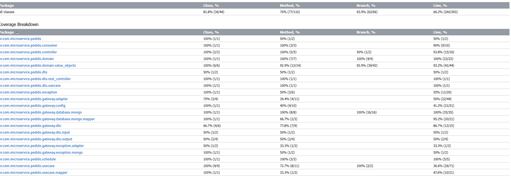

# Tech Challenge 04 - Pedido

- Introdução
- Funcionalidades
- Tecnologias
- Instalação
- Banco de Dados
- API
- Qualidade de Software

***

## Introdução

Esta aplicação é um microsserviço focado no gerenciamento de pedidos, implementando princípios de Arquitetura Limpa. Ele se integra com outros microsserviços para obter dados de clientes e processar pagamentos. Este projeto faz parte do Tech Challenge 04 da pós-graduação de `Arquitetura e Desenvolvimento Java` da instituição FIAP.

O projeto pode ser acessado em: `https://github.com/joao-v170r/micro-pedido-clean-arch`

***

## Funcionalidades

O microserviço de pedidos oferece as seguintes funcionalidades:
* Criação de novos pedidos.
* Busca de pedidos por ID.
* Verificação da existência de um pedido por ID.
* Listagem de todos os pedidos.
* Listagem de todos os pedidos com paginação.
* Exclusão de pedidos por ID.

***

## Tecnologias

As seguintes tecnologias foram utilizadas no desenvolvimento deste projeto:
* **Spring Boot**: Framework web para construção de aplicações Java.
* **Maven**: Ferramenta de automação de construção e gerenciamento de dependências.
* **Swagger/Springdoc OpenAPI**: Para documentação e interface de testes da API.
* **RabbitMQ**: Broker de mensagens para comunicação assíncrona.
* **MongoDB**: Banco de dados NoSQL para persistência dos dados de pedidos.
* **WebFlux**: Para chamadas reativas a outros serviços.
* **Lombok**: Para reduzir boilerplate code.
* **Mockito**: Framework de mocking para testes unitários.
* **JUnit 5**: Framework de testes para Java.

***

## Instalação

Para executar o projeto localmente utilizando Docker, siga os passos abaixo:
1.  Certifique-se de ter o Docker Desktop instalado em sua máquina.
2.  Clone o repositório do projeto: `https://github.com/joao-v170r/micro-pedido-clean-arch`.
3.  Navegue até o diretório raiz do projeto: `cd micro-pedido-clean-arch`.
4.  Execute o projeto utilizando Docker Compose:
    ```bash
    docker-compose up --build
    ```
    Este comando irá iniciar o microsserviço Spring Boot (`pedido-app`) e o banco de dados MongoDB (`mongodb-pedido`).

O Swagger UI estará acessível em: `http://localhost:8081/swagger-ui/index.html`.

***

## Banco de Dados

O microsserviço utiliza MongoDB como banco de dados. A entidade principal é `Pedido`.

### Entidade Pedido

| Campo            | Descrição                                         |
| :--------------- | :------------------------------------------------ |
| `id`             | Identificador único do pedido.                    |
| `reciboPagamento`| Código do recibo de pagamento gerado pelo gateway de pagamento. |
| `cliente`        | Dados do cliente associado ao pedido (ID, nome, CPF, email). |
| `dataCriacao`    | Data e hora da criação do pedido.                 |
| `produtos`       | Lista de produtos incluídos no pedido, cada um com ID do produto, preço e quantidade. |
| `status`         | Status atual do pedido (ex: CRIADO, PROCESSANDO, FINALIZADO). |
| `enderecoEntrega`| Endereço de entrega do pedido (CEP, endereço completo, latitude, longitude). |
| `frete`          | Valor do frete do pedido.                         |
| `metodoPagamento`| Método de pagamento escolhido (ex: PIX, BOLETO). |

***

## API

### Pedido

| Método | URL                  | Ação                                      | Requisição de Exemplo                                                                                                                                                                                                                                                                                                                                                                                              |
| :----- | :------------------- | :---------------------------------------- | :-------------------------------------------------------------------------------------------------------------------------------------------------------------------------------------------------------------------------------------------------------------------------------------------------------------------------------------------------------------------------------------------------- |
| `POST`   | `/create-pedido`     | Cria um novo pedido.                      | ```json { "idCliente": "123", "dataCriacao": "2024-05-21T10:00:00", "produtos": ["prod1", "prod2"], "enderecoEntrega": { "cep": "27521-000", "enderecoCompleto": "Rua Exemplo, 100", "latitude": 100, "longitude": 100 }, "frete": 15.50, "metodoPagamento": "PIX" } ```                                                                                                                                             |
| `GET`    | `/pedido/{id}`       | Obtém um pedido pelo ID.                  | (Sem corpo de requisição)                                                                                                                                                                                                                                                                                                                                                                           |
| `GET`    | `/pedido`            | Obtém todos os pedidos (com paginação opcional). | `GET /pedido?page=0&size=10`                                                                                                                                                                                                                                                                                                                                                                          |
| `DELETE` | `/pedido/{id}`       | Apaga um pedido pelo ID.                  | (Sem corpo de requisição)                                                                                                                                                                                                                                                                                                                                                                           |

***

## Qualidade de Software

### Testes

Foram implementados testes unitários e de integração para garantir a qualidade do software e atingir uma alta cobertura de código.

A cobertura de código atual pode ser visualizada na imagem abaixo.

<div align="center">
    
</div>
